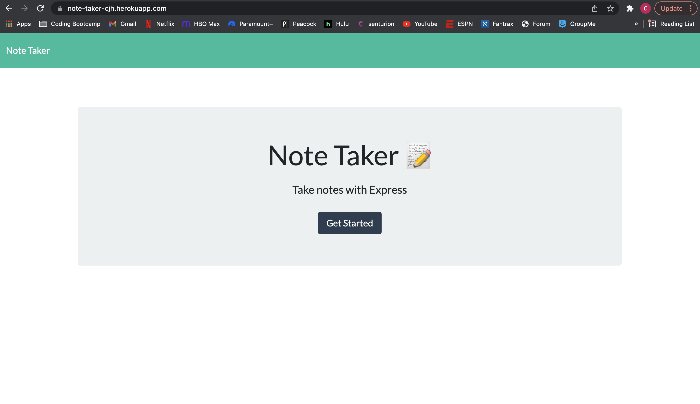
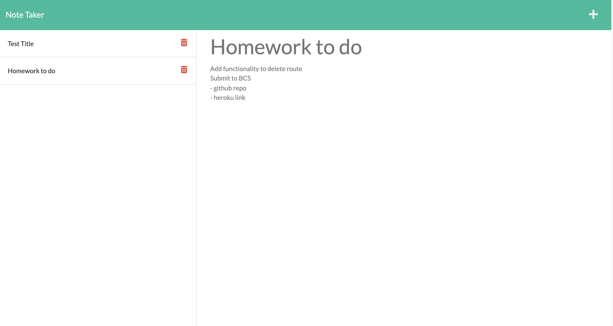

# Note Taker

## Description

This application can be used to write and store notes all in one place. The front end for the application was already created, and it was my task to write the back end, connect the front and back ends, and deploy the application to Heroku. I accomplished this by using Express.js for the back end and storing the notes in a JSON file.

## Table of Contents

- [Installation](#installation)
- [Usage](#usage)
- [License](#license)
- [Contributing](#contributing)
- [Testing](#testing)
- [Questions](#questions)

## Installation

Download the project to your device and run npm i to install the dependencies

## Usage

You can access the project at https://note-taker-cjh.herokuapp.com/ to write and save your own notes. You can also see screenshots of the deployed application below:

## License

This application is covered under the MIT license.

## Contributing

Adhere to the contributing covenant

## Testing

Tests have not been performed

## Questions

If you have any questions, please feel free to contact me via:

- Github: [chighum](https://github.com/chighum)
- Email: [chighum41@gmail.com](mailto:chighum41@gmail.com)
